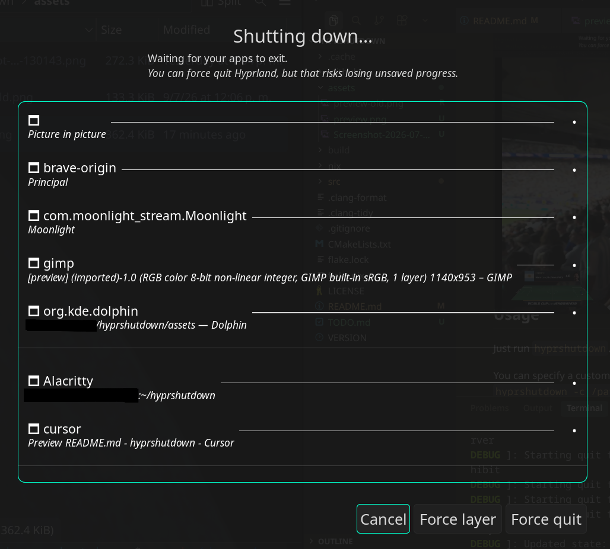

## hyprshutdown
A graceful shutdown/logout utility for Hyprland, which prevents apps from crashing / dying unexpectedly.



## Usage

Just run `hyprshutdown`. This will close all apps and exit Hyprland.

You can specify a custom configuration file path using:
`hyprshutdown -c /path/to/config` or `hyprshutdown --config /path/to/config`

See `hyprshutdown -h` for more information.

## UI Controls & Visual Layout

`hyprshutdown` features a real-time, interactive Wayland UI built using `hyprtoolkit` to monitor and control the shutdown sequence.

### Visual Indicators
- **Spinners**: A yellow rotating spinner (⠋) is shown next to applications that are currently executing their graceful quit sequence.
- **Layer Surface Icons**: Wayland layer surfaces (such as `waybar` or `hyprpaper`) are detected and shown with a distinct layer icon (`🗗`), while normal windows use a window icon (`🗖`).
- **Dividers & Sorting**: Active apps in the list are grouped and sorted by stage layer. Within each layer, they are sorted by:
  1. GUI Windows
  2. Wayland Layer Surfaces
  3. Background Programs/Processes
  
  Layers are visually separated in the list view by a thin horizontal divider line (25% opacity of the separator line color).

### Interactive Controls
- **Force layer**: Positioned between **Cancel** and **Force quit**. Clicking this immediately force-kills (`SIGKILL`) any remaining active processes/windows in the currently executing layer and advances to the next shutdown layer.
- **Force quit**: Instantly kills all active applications across all stages and exits Hyprland.
- **Cancel**: Aborts the sequenced shutdown and exits the utility.

### Notes

`hyprshutdown` does **not** shut down the system, it only shuts down Hyprland.

`hyprshutdown` does not work with anything other than Hyprland, as it relies on Hyprland IPC.

## Configuration

You can customize the shutdown sequence using a configuration file located at `$XDG_CONFIG_HOME/hypr/hyprshutdown.conf` (which defaults to `~/.config/hypr/hyprshutdown.conf`).

This file allows you to specify rules for sequenced shutdown layers using a block-based `{}` syntax. Each layer contains named blocks specifying program match criteria and their timeouts:

- `layer_N`: defines a shutdown stage layer, where `N` is an integer >= 0.
  - Layers with `N > 0` are executed first in ascending order (layer 1, layer 2, etc.).
  - Unconfigured programs (the "everything else" category) are closed in the middle stage (`normal` stage).
  - `layer_0` is the absolute last stage of the shutdown sequence.
  - Multiple applications in the same layer are requested to stop at the same time.
  - Empty layers (where no matching programs are currently running) are automatically skipped.

### Match Methods and Options
Inside each program block under a layer, you can define match criteria (all specified criteria must match):
- `class = "pattern";` (or terminated with `:`): match the window class.
- `title = "pattern";`: match the window title.
- `name = "pattern";`: match the process name.
- `cmdline = "pattern";`: match the full command line of the process.
- `path = "pattern";`: match the absolute executable path.
- `user = "pattern";`: match the username of the process owner.
- `pid = "pattern";`: match the process ID.
- `timeout = value;`: specifies the waiting time (in seconds) after sending the graceful quit signal before force-killing (`SIGKILL`) the application.
  - Can be set to a float value (e.g. `5.0` or `5`).
  - Can be set to `unlimited`. If set to `unlimited`, `hyprshutdown` will wait indefinitely for the application to close gracefully.
  - If `timeout` is `0` or `0.0`, the graceful close is bypassed entirely and the program is force-killed (`SIGKILL`) immediately when its stage starts.

The `pattern` values are standard regular expressions (ECMAScript syntax).

### Default Block (Unconfigured Apps)
For any application not explicitly matched by any rule, you can configure its default force-quit timeout, shutdown layer, and visibility using:
```
default {
    timeout = value;
    layer = N;
    hidden = true;
}
```
* `timeout`: defaults to `5.0` seconds if not specified.
* `layer`: can be set to an integer (e.g. `1` to close them alongside layer 1 apps, `0` to close them last). If not specified, they are closed in the middle (`normal` stage) before `layer_0`.
* `hidden` (or `hide`): set to `true` to hide all unconfigured applications from the UI list.

### Match and Hiding Rules
Within layer blocks, you can configure rule blocks for specific apps. In addition to matching criteria, you can hide them or whole layers from the UI list:
* Set `hidden = true` (or `hide = true`) inside a layer block to hide all apps in that layer from the UI.
* Set `hidden = true` (or `hide = true`) inside a program's block to hide only that program.
* Hidden programs are still closed in their configured sequence, but do not show up in the visible list.

### General UI Styling & Settings
By default, the application's color theme is inherited from the global `hyprtoolkit` configuration file (located at `~/.config/hypr/hyprtoolkit.conf` or `$XDG_CONFIG_HOME/hypr/hyprtoolkit.conf`).

You can override specific layout, styling, and exit variables in your `hyprshutdown.conf` using a `general` block:
```
general {
    line_color = "#ff00ff";      # Hex color code for the horizontal separator line (defaults to active text color)
    row_margin = 14;             # Vertical margin/spacing (in pixels) between rows (defaults to 14)
    line_width = 1;              # Thickness/width (in pixels) of the separator line. Set to 0 to deactivate/hide the line (defaults to 1)
    hide_processes = true;       # Hide all background process clients by default unless explicitly configured otherwise (defaults to false)
    systemd_user_exit = true;    # When enabled, this runs `systemctl --user exit` right after exiting Hyprland (defaults to false)
}
```

### Example Config
Create `~/.config/hypr/hyprshutdown.conf`:
```
# General settings
general {
    systemd_user_exit = true;
}

# Close Firefox first (in layer 1), wait up to 5 seconds
layer_1 {
    firefox {
        class = "firefox";
        timeout = 5.0;
    }
}

# Close Alacritty second (in layer 2), wait indefinitely
layer_2 {
    terminals {
        class = "alacritty";
        timeout = unlimited;
    }
}

# Close KeePassXC last (in layer 0), wait up to 10 seconds
layer_0 {
    keepass {
        class = "keepassxc";
        timeout = 10.0;
    }
    # Close waybar last (in layer 0), wait indefinitely
    bar {
        path = "/usr/bin/waybar":
        class = "waybar";
        timeout = unlimited;
    }
}

# For all unconfigured/normal apps
default {
    timeout = unlimited; # recomended to not stop programs were you migth lose changes;
    layer = 5;
}
```

